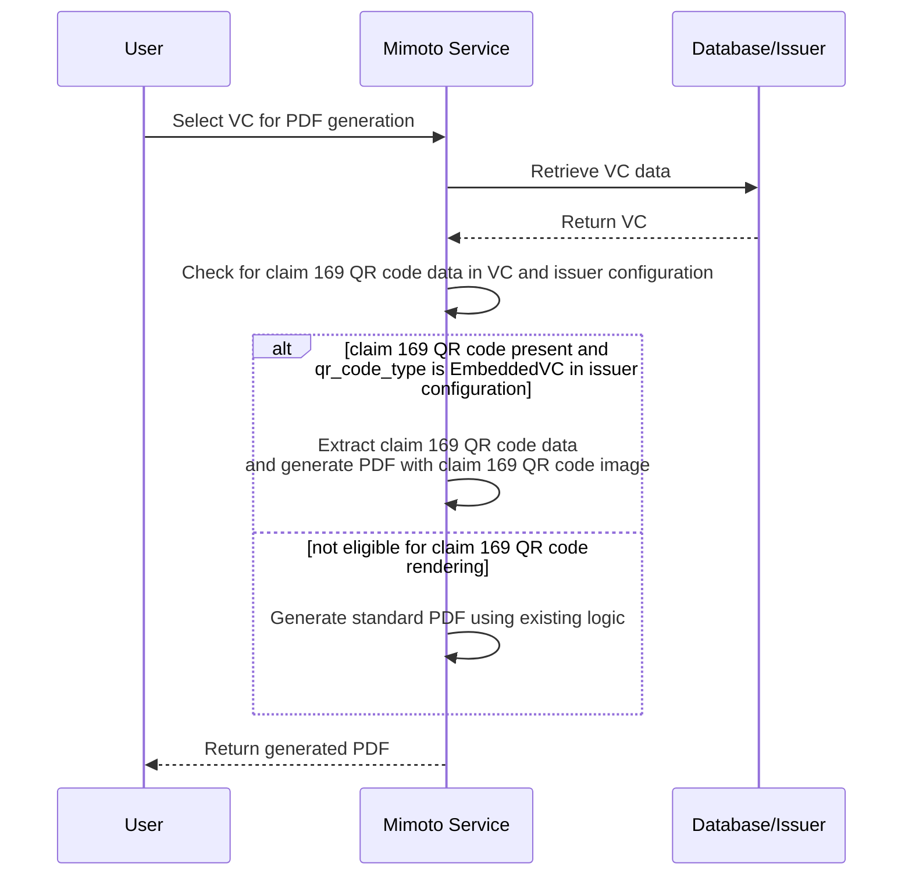

# Claim 169 QR Code Support

## Overview
Mimoto now supports consumption of claim 169 QR data present in the Verifiable Credential (VC) issued by the issuer. This feature allows users to easily access and utilize the claim 169 data for various purposes, such as displaying it in the user interface or using it for verification. Mimoto now gives preference to claim 169 QR code present in the VC while displaying and generating PDF for VCs.

## Pre-requisites
- VC should be valid and should contain claim 169 QR code data in the expected format. For e.g. for JSON-LD VC, claim 169 QR code data should be present in the `credentialSubject` section of the VC with the key `claim169`.

    ```json
      "claim169": {
      "identityQRCode": "NCF4:OCFBI%S:2EQ7NMC2558J6HW8VDQ0DW8V27MMSLYG%8WTGTEF9-8G7K6A5S+ORSWH4%F12802V4.HFZST%UL1ALNR0REWRMWKHW8NZFWNI64C3/PE8$TTOS5$DZTJQA7LZ7E7G$XDMXOI+LG9U%LPK0W2BSM*JT5SD$5LJM2TU/EDS2PF+7WCFYHUCLSEPI/F4 02P4I7-HGK356TQSCH+7J7QW J-WL6QU*CUI-VI83LN37TU2+C90R.9SM9M8MVCGW89UHVDQ8TX362%V6VE2AKWH392GTFF69K%ZIV3E9PBXS932EGZSO/C4CUA8SBKVP3V-8P3CU+HBG0CNID.+FPSF--MWBNQLSRBP71EQOVA 38*9K$1VMF7ZBJ9FCR5:EC6SJT-EE05LIRILP 0PX6H55I/1KWOREMBD2GTWF4LRWKGSPDO75XXHTD8K5M9Y6ADQEHJUAV L4UTG6$P:VOZ8U7MP 5D4E4IQHR9OSJNH93Q.V$H8.U0RPUKY7U8UPCWRN52ICIGO4SD:-K5/NF7JXXCR*R94FB/DSOJU7LP6OE DG/E:382DF8TM1RDRIKHSEQ6VKZU%WOEYVJNFZ7U$U5C24/+NZA9N8FJ18OC90A0T95BDBIS7*X6W2T.QVTNF8XQM5M58GHENVKPKW8VNP91MC.F/JO.07$WQSR6+ U+A8OQPA1KS3S8+O6M2FYT%BQE6AMHUH*P/GVLTRX$H%WSCGBH$UAM8*4VV*8U7V*.1TPFOBV754BEGNDN$Y0WL3QASDKJ3 BJJ0:+TF+GHUFHFJ/ 93*2BMDLXDAIGS.00*5C20FBM:NH7VQEXT/093+EP70ABVTI47.0ZCF3M5QKU2HO%%7G/DOZP0XR N1CX17%083B.J3AIIQEG%JLMXLESL7IGFF40AC5IK-%LS86WD2 GF8QQWK1EX8L01M$37XFIOGHFDD6U/LDF.4PHN4Q0NGKMLHT%H0Q7B8E$DL-AR-9JK9N%A762UAU29AHOWI2F6UFFJ%4U$HH/CHNDRMBM37NP2YVTY38W$U:U51GW9YS ZS 8WMR64IE6ESQPSFFJZPDKNS$*J-O7 K1R.7IINE:062W7P67/P/BNZ4O/RO+CI$V9.4TJJM2.QPH6QOPI17GVI%V1/.BGOS0D9J%UF1IY04ZWI QKJBC6:PTQJ/+V:1IPQ55ELODDON7RATHMDF$H%OBZ19-MP-RA-$3*2HOIGRMM0L1SJLIQ7JBIXWTVN7B3WYS8%$E352QV7//F-UO6X1VJO:AVMVP7:SQCENLTP8O4UMMW0.SQ A2 5L FKY:K%YFDRC-OGJX9QVG.O8TE9S5S6DDGURZ-G+98.8PPGKMU1FOAMXHHE3U41KLMODWU7K1:0973G.VLN3FFWFALDU1NA2D85%X0AKSWABFG829GEU4DL4TK5 MD5RHXVPO:CRO12/S59W77514J6*MSZ52FK+HG+.1BWI+LM$HM08TI%RT*JATA4TF/ZB7W0S3LHA1WTC:E43/VSE459GLSUN$CK+G.:SV*RXONP7K*K7W$KBIS*YIDBDVZQOP2+FOR$QS2M5RLS8B0M6J*R2JBWNH+R5OLUYH1U.4::C%44BR2DPQBS5ICQH2A6VJ2/8YBBUYVVK6DPGG55-79SZIZUQ9GO. QZ8B%Z3TDT-ZMHMAP+I7AC1UKCHA HQ14E0.H1.QTHL6CF59R3XG3XP% 8T40LK7EQ5DQKA44-UC RPSS1LN12/8VPT9W94N8UPODIUV8O$H5QQ9$+3N+LY9GJIT3F7KCG-85NM5FM0CL3QZF//CNR3BADWPJRC54W258A9*8B8E%SLC$P8:A0ASPGRRDP%364OCST68FQXE2Q6MQO6WVL1DW%02P0P+YH:%GKCDF:V-DFG9FV08LRT-CAF/S5-T+FE*SLW.N8.4:SMI6R8HJHU0.46FYL/+A1RNI5UST1L0KYQK3FAV*2SSA5CLX76XI7UI0UGPW239 OQ2VOABC+I+.TQKHY9J-3DR2BJEPMM82GO-KLE-97 A1DOZOR7:FJR40J5A.KITUBTA*CA-I4+OQ2JG9R2C.O%IG6ZIB*TFQ53-8795F3JP$7LC07CK1MV PDRL2+ZKW5HBVP0J5Z34XXBTDTBUT:GRMLBU6E%%DP81RY8S9O4 I92DUJHU*1+$VX7K UVF*0E*T8G1DR8O+1H0RVVRT-TJNK*S50371B5OI6XZ9%OGXD98IUEIT61C3U4XMQ*300VAG/MD57AEFK+L.HAD470:CJAF9%AKFTI8B:QPW$MRF9.Y9UMT+-T6+45U0FTB%1LHH9O/GUFR2YA Y9CLKLDH*LDL+K/MLPVCHBHYI7CV9SLH%88-BI*9IHQM9I295LGQAP%Q8DM-MI*/A/00F NYB4S+5A4SDW4GN9PDB26L1$04$C7QEMW4B24LT02/HIL2XZ8%H9EOI1LLB%0.JU7YCM$Q321KPLHELXMH2XJ5MA516WC2% BKZH-71S*80/IN*K-X9+O68UO*FDHWI94UQJKVAB414EJG+RA7G4EHS/G5*P6C+S5D48P8RJNH6SCF7GV5$:Q48V%J7:C40FSX$F.1SX070-7ON2P5AC$K:9DXY1B.OZ8AT N5NP3QV/ST3Z4O469-E7Y50:MB$13L0IBLCQSTJJYGH0-A XJRW8 1T9E5NYAVYKJF7NP2SGPSPLT.9PHLG+09ACK*3002D0GUF9S6DX/17-EFPQ JL9-GO7ME155H7G86FE210HF$A/CI026WEB-PPD489 0UH8$/1B78$YT R9%DEIKLIY6173 4CBL9:+KUVTX.BQUDH52+F91ZS8:8%EM*VFZ3EE$FF9B0M9J%EKPPXZB+DLYZQELG+J5VEPA7BD4NC+P3 9TGE0I5-OL8ZAJUHS727WB5PC ZDDH4I5VU2GAGN:BN$23RF5ZJDDDJYSRNR22J71L9M/47R2:69 RQ4ZS1VUYHRUMOYX40Z6130X8JJTIPC9.+A4DO584/ONE*P3OL-5OIYPP$RR5TOJJ3GUI*6CLRJ0AQRH$24C0L7$8/VV56GL$4S/0/+CAY8D$TZ+99PKBSU% C87IH2KN77SL5PXCP*7UVA*3BR3L3U717FO/JT4LUZ04/A4EOJQU P2$WA*0NQ1J6KT8M31R1N9S3Q096R:5WEYA%QL$XAPXIY32HANR%JZZVD936ND+ GTHE.$ABXV4.3Q-O8XNDQGK7R5YG1Z384BMN5M+U /FE5E$+HMYFLSEICQJ6D:/4R$OJ+O UTFG4I8VT4C148/V7DPJCMRR 2G.TVSNX0E1J7OBS7A9CW1U62L2707F6PD/PO 0JZPFN A1Y79WK+48D4MG/BDZRTHREEVVI3OCF+0V: 1RZ6"
      },
    ```
- The claim 169 QR code data should be in the expected format as per the requirements of the application consuming it. Refer Claim 169 QR Code specification for further details : https://docs.mosip.io/1.2.0/readme/standards-and-specifications/mosip-standards/169-qr-code-specification
- Issuer configuration should have `qr_code_type` set as `EmbeddedVC`.

## User flow :
**Note: The flow is applicable for both guest users and wallet users.**
1. When a user selects a VC that contains claim 169 QR code data, Mimoto will check for the presence of claim 169 QR code data in the VC.
2. If claim 169 QR code data is present, Mimoto will extract the QR data in first field inside `claim169` object, generate QR code image and add it to the QR code placeholder in the generated PDF.
3. PDF is returned to the user.

## Sequence Diagram


## References 

- [Claim 169 QR Code Specification](https://docs.mosip.io/1.2.0/readme/standards-and-specifications/mosip-standards/169-qr-code-specification)