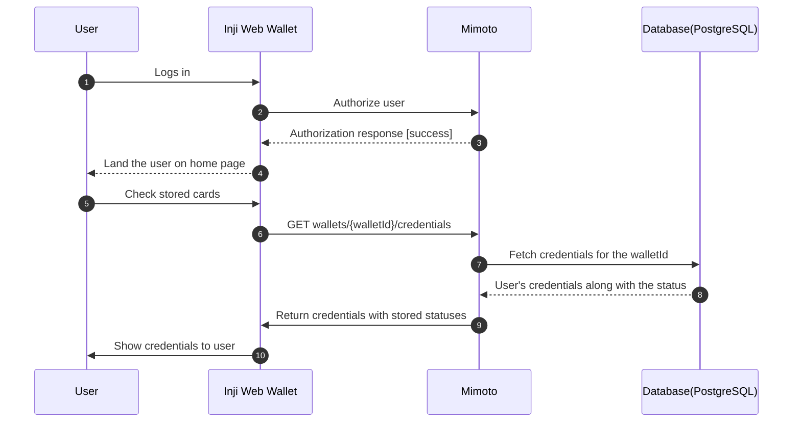
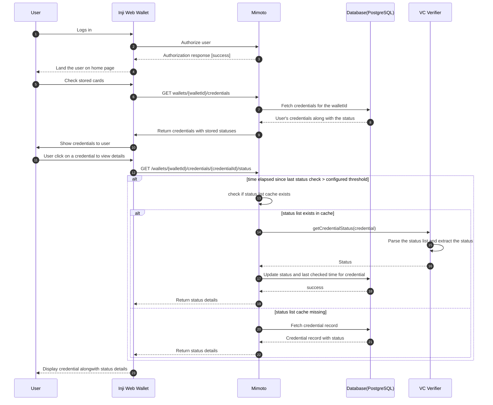
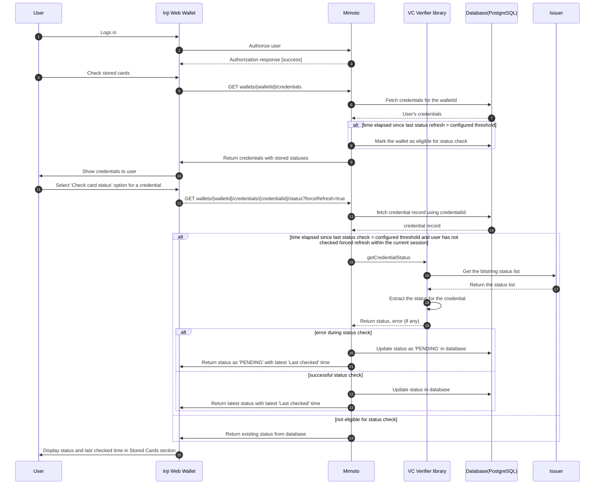
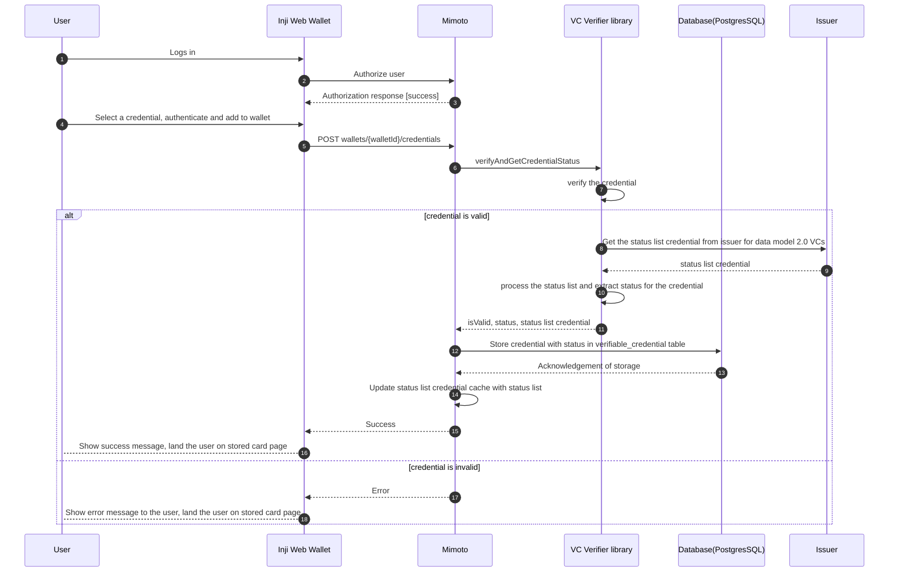

# Verifiable Credentials Status check

This design document outlines the approach for implementing status checks for Verifiable Credentials (VCs) within our system. The goal is to ensure that the status of a VC can be verified efficiently and securely, allowing relying parties to determine whether a credential is valid, revoked, or suspended.

### Overview

W3C Data model 2.0 supports status checking for Verifiable Credentials through the use of a `credentialStatus` property. This property points to a status list that can be queried to determine the current status of the credential.

### High level user flow

#### Flow 1 : User lands on Inji Web application and views stored VCs with their status

- The user logs in and opens the Stored Cards page.
- All saved credentials are shown along with their current status.
- The status displayed comes only from the database - the status value returned by the /credentials API. The issuer is not contacted to fetch or refresh status at this stage.
- For credentials that were added before migrating to the latest application, their status will be set to VALID by default using a database upgrade script.
- The status field will be returned as an array. Mimoto will return all applicable status purposes for a credential as-is, without any transformation. Converting these into user-friendly labels will be handled by Inji Web.
- If no status is explicitly set and the VC has not expired, VALID will be returned by default, indicating that verification passed without issues.

Sequence Diagram:



#### Flow: User views a credential
- The user opens the Stored Cards page and selects a credential to view its details.
- Mimoto will check if the time elapsed since the last status check exceeds a configured threshold (e.g., 24 hours).
- If the threshold is not exceeded, Mimoto returns the existing status from the database without performing a fresh check.
- If threshold has exceeded, the status check API looks for the credential’s status list in the cache.
- If a cached status list is found, it is sent to the VC Verifier to parse and determine the current status. The “last checked” timestamp is taken as the time when this data was cached.
- If no status list is found in cache, the system falls back to the status stored in the database and returns that value to the user.



#### Flow : User clicks on 'Check card status' option for a credential
- The user selects the 'Check card status' option for a specific credential in their wallet.
- Mimoto checks if the user has already performed a status check for this credential within the configured threshold time (e.g., 24 hours).
- If the threshold time has not elapsed, Mimoto returns the existing status from the database without performing a fresh check.
- If the threshold time has elapsed, Mimoto retrieves the credential status list from issuer and invokes the VC Verifier library to check the status of the credential. Finally updates the status in the database.

Sequence Diagram:



#### Flow 3 : User adds a credential to wallet

- User logs in to Inji Web application
- Selects and adds a new verifiable credential to their wallet
- During the addition process, the system performs an immediate status check for the newly added credential using the VC Verifier library
- The system updates the status of the credential in the database based on the result of the status check and caches the status list
- The user is notified of the successful addition of the credential along with its current status
- The newly added credential is now available in the user's wallet with its status displayed

Sequence Diagram:



### API Contract

#### Fetch All Credentials with Status

`GET wallets/{walletId}/credentials`

**Description**: Retrieves all verifiable credentials stored in a specific wallet along with their current status.

**Path Parameters**:
- `walletId` (string, required): Unique identifier of the wallet

**Response**:

Two new fields to be added in the response payload:
- `status` (string[]): Current status of the credential (e.g., VALID, revocation, EXPIRED, PENDING)
- `lastCheckedAt` (string, ISO 8601 format): Timestamp of the last status check performed for the credential

**Success (200 OK)**:
```json
[
  {
    "issuerDisplayName": "Mosip",
    "issuerLogo": "https://example.com/logo.png",
    "credentialTypeDisplayName": "National Identity Department Mosip",
    "credentialTypeLogo": "https://example.com/credential-logo.png",
    "credentialId": "1234567890",
    "status": ["VALID", "revocation"],
    "lastCheckedAt": "2025-12-11T10:30:00Z"
  }
]
```

#### Check Credential Status

**Endpoint**: `GET /wallets/{walletId}/credentials/{credentialId}/status`

**Optional Query Parameter**:
- `forceRefresh` (boolean, optional): If set to `true`, forces a fresh status check regardless of the last checked time.

**Description**: Retrieves the current status of a specific credential. Performs a fresh status check if the configured threshold time has elapsed since the last check, otherwise returns cached status from database.

**Path Parameters**:
- `walletId` (string, required): Unique identifier of the wallet
- `credentialId` (string, required): Unique identifier of the credential

**Response**:

**Success (200 OK)**:
```json
{
  "credentialId": "string",
  "status": ["VALID","revocation"],
  "lastCheckedAt": "2024-12-11T10:30:00Z",
  "isFreshCheck": true,
  "message": "string (optional)"
}
```

**Response Fields**:
- `credentialId`: The unique identifier of the credential
- `status`: Current status of the credential
  - `VALID`: Credential is active and valid
  - `EXPIRED`: Credential has expired
  - `PENDING`: Status check is queued or in progress
  - Other statuses as per credential status purposes defined in W3C Data Model 2.0 (e.g., revocation, suspension)
- `lastCheckedAt`: Timestamp of the most recent status check
- `isFreshCheck`: Boolean indicating whether this response contains freshly checked status (`true`) or cached status from database (`false`)
- `message`: Optional message providing additional context (e.g., error details when status is PENDING)

**Error Responses**:

- **404 Not Found**: Credential or wallet not found
```json
{
  "errorCode": "CREDENTIAL_NOT_FOUND",
  "message": "Credential with ID {credentialId} not found for wallet {walletId}"
}
```

- **400 Bad Request**: Invalid request parameters
```json
{
  "errorCode": "INVALID_REQUEST",
  "message": "Invalid walletId or credentialId format"
}
```

- **500 Internal Server Error**: Unexpected error during status check
```json
{
  "errorCode": "INTERNAL_SERVER_ERROR",
  "message": "An unexpected error occurred while checking credential status"
}
```

**Behavior Notes**:
- If threshold time hasn't elapsed since last check, returns cached status with `isFreshCheck: false`
- If threshold time has elapsed, performs fresh status check and returns with `isFreshCheck: true`
- If fresh status check fails, returns status as `PENDING` with `isFreshCheck: true`
- The `lastCheckedAt` timestamp always reflects when the status was actually last verified with the issuer

### Database Schema

#### verifiable_credential Table

This table stores the verifiable credentials along with their status information. Two columns to be introduced for status tracking : 

| Column Name            | Data Type     | Description                                                                           |
|------------------------|---------------|---------------------------------------------------------------------------------------|
| status                 | VARCHAR(20)[] | Current status array of the credential (e.g., VALID, revocation, suspension, PENDING) |
| status_last_checked_at | TIMESTAMP     | Timestamp of the last status check performed                                          |

Possible values for `status` column (mimoto status representation):
- `VALID`: Credential is active and valid, applicable for all type of VCs. 
- `EXPIRED`: Credential is expired, applicable for all type of VCs.
- `PENDING`: Status check is queued for retry.
- Other statuses as per credential status purposes defined in W3C Data Model 2.0 (e.g., revocation, suspension)

### Migration of existing credentials

A one-time migration script will be executed to initialize the `status` and `status_last_checked_at` fields for existing credentials in the `verifiable_credential` table. The script will set the initial status to `PENDING` and the `status_last_checked_at` to the current timestamp, indicating that these credentials need to be checked for their status during the next scheduled batch job or manual check.
