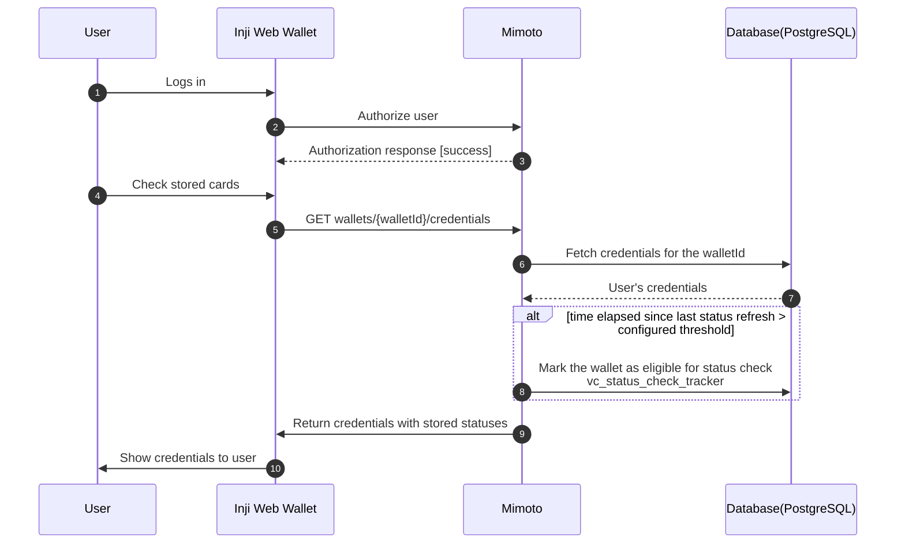
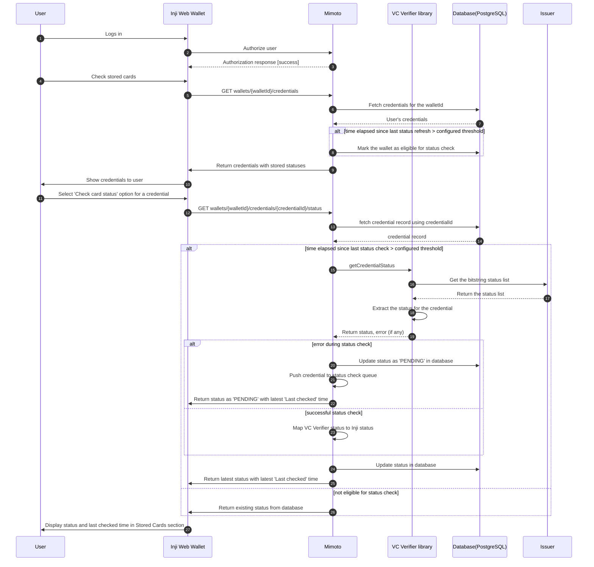
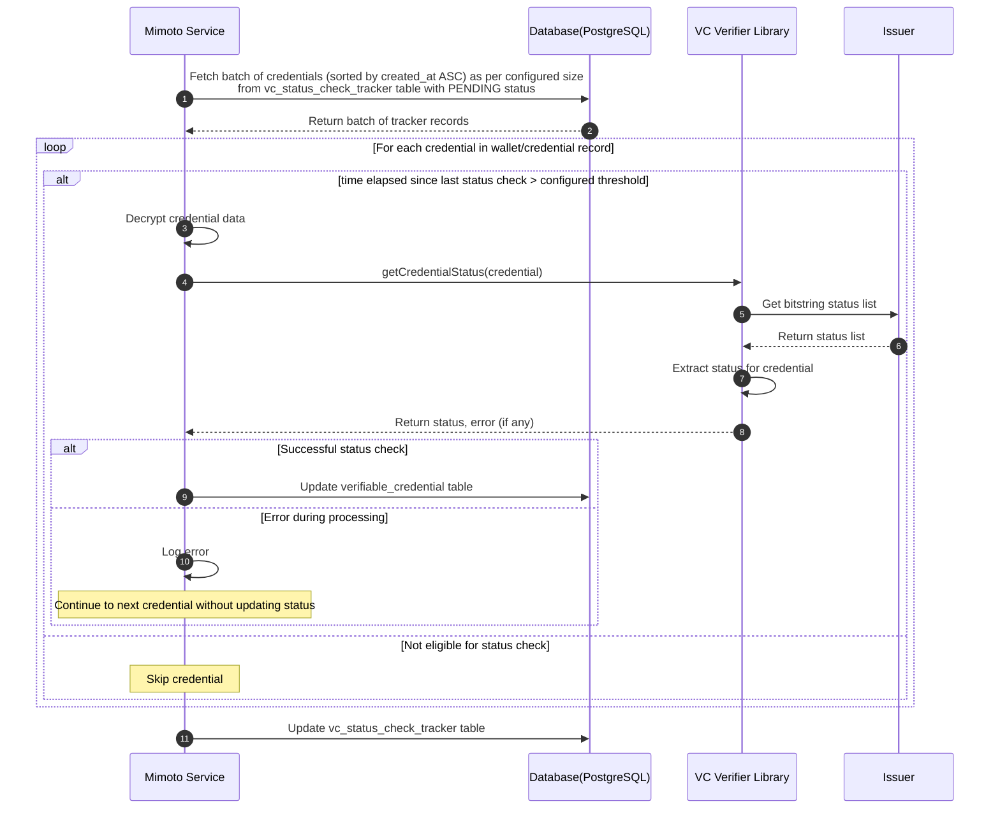

# Verifiable Credentials Status check

This design document outlines the approach for implementing status checks for Verifiable Credentials (VCs) within our system. The goal is to ensure that the status of a VC can be verified efficiently and securely, allowing relying parties to determine whether a credential is valid, revoked, or suspended.

### Overview

W3C Data model 2.0 supports status checking for Verifiable Credentials through the use of a `credentialStatus` property. This property points to a status list that can be queried to determine the current status of the credential.

### High level user flow

#### Flow 1 : User lands on Inji Web application and views stored VCs with their status

- User logs in to Inji Web application
- Navigates to 'Stored Cards' section
- API calls to fetch stored VCs and their stored 'Status'
- The system checks if the enough time has passed since the last status check (e.g., 24 hours)
- If enough time has elapsed (as per configuration), the system marks wallet as eligible for status check in `vc_status_check_tracker` table - if not already marked
- If enough time has not elapsed, the system skips the status check for that wallet
- For each eligible wallet, the system retrieves the stored VCs and status from the database

Sequence Diagram:

#### Flow 2 : User tries to check status of stored VCs manually

- User logs in to Inji Web application
- Navigates to 'Stored Cards' section
- User selects a specific VC to check its status
- Inji Web application sends a request to Mimoto API to check the status of the selected VC
- Mimoto check if threshold time has passed since last status check for the wallet
- If within credential-level status check limit, Mimoto proceeds to check the status of the VC immediately
- If not, Mimoto returns the last known status of the VC from database without performing a new check
- In case of any error during status check, Mimoto pushes the credential to check status queue for later processing, updates the status as 'PENDING' in the database and returns the same.

Sequence Diagram:

### Batching Job for status checks

To optimize performance and reduce the number of external calls to issuers, the system will implement batching logic for status checks. When multiple credentials from the same issuer need to be checked, the system will group these requests and perform a single batch status check.

#### Batching Flow
Select a batch of credentials for status check, with batch size configurable via system settings. Sort credential records by \`created_at\` timestamp in ascending order. 
- For each credential in the wallet/credential record:
  - Check if the time elapsed since the last status check exceeds the configured threshold. If not, skip to the next credential.
  - If eligible for status check:
    - Retrieve the credential record from the database and decrypt the credential data.
    - Invoke the VC Verifier library to perform the status check on the credential.
    - Update the status in \`verifiable_credential\` table.
    - If an error occurs during processing, log the error and continue with the next record without updating the status.
    - After processing the batch, update the \`vc_status_check_tracker\` table to reflect the completion of the status check for each record in the batch.

### Database Schema

#### verifiable_credential Table

This table stores the verifiable credentials along with their status information. Two columns to be introduced for status tracking : 

| Column Name            | Data Type     | Description                                      |
|------------------------|---------------|--------------------------------------------------|
| status                 | VARCHAR(20)   | Current status of the credential (e.g., VALID, REVOKED, SUSPENDED, PENDING) |
| status_last_checked_at | TIMESTAMP     | Timestamp of the last status check performed     |

#### vc_status_check_tracker Table

This table tracks the status check operations for verifiable credentials.

| Column Name | Data Type | Description                                                                         |
|------------|-----------|-------------------------------------------------------------------------------------|
| wallet_id | VARCHAR(36) | Unique identifier for the wallet                                                    |
| credential_id | VARCHAR(36) | Unique identifier for the credential                                                |
| issuer_id | VARCHAR(50) | Identifier of the credential issuer                                                 |
| credential_type | VARCHAR(50) | Type of the credential                                                              |
| run_status | VARCHAR(20) | Current status of the status check run. Two possible status: `PENDING`, `COMPLETED` |
| created_at | TIMESTAMP | Timestamp when the record was created                                               |
| completed_at | TIMESTAMP | Timestamp when the status check was completed                                       |

